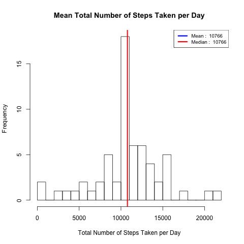
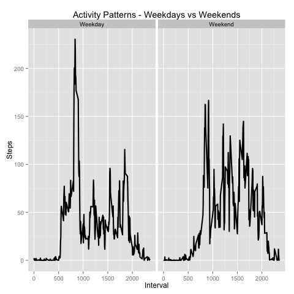

## Loading and preprocessing the data
First of all, I load data from the csv file.
```r
activity <- read.csv("activity.csv")
```
Next, I ensure the data is valid. Below is a helper method dealing with numeric input. Any non-numeric entries are flagged as invalid (NA).
```r
# Converts a provided vector into a numeric one
as_numbers <- function(v) {
  v <- as.numeric(v)
  
  # Flag all non-missing non-numeric values as missing
  v[is.nan(v)] <- NA  
}
```
Steps and intervals are transformed into numeric vectors.
```r
# Treat steps as numeric values
as_numbers(activity$steps)

# Treat intervals as numeric values
as_numbers(activity$interval)
```
Textual date representations are turned into date objects, YYYY-MM-DD format is assumed. 
```r
# Convert cells of the 'date' column into date values in YYYY-MM-DD format
activity$date <- as.Date(activity$date, "%Y-%m-%d")
```


## What is mean total number of steps taken per day?
I start with summarizing daily total steps, missing values are skipped.
```r
# Summarize daily total steps, skip missing values
total_steps <- aggregate(list(steps = activity$steps), list(date = activity$date), sum, na.rm = TRUE)
```
In the next step, I plot the summary as a histogram.
```r
# Render a histogram of daily total steps
png("plot1.png")
hist(total_steps$steps, 
     breaks = 20, 
     main = "Mean Total Number of Steps Taken per Day",
     xlab = "Total Number of Steps Taken per Day")
```
Next, I calculate mean and median and add them as vertical lines to the histogram. 
```r
# Additional aggregations along with visualization info
activity_stats <- data.frame(
  val = c(
    round(mean(total_steps$steps)), 
    round(median(total_steps$steps))),
  col = c("blue", "red"),
  lbl = c("Mean", "Median"))

# Plot each of the aggregations
apply(activity_stats, 1, function(x) {
  abline(v=x["val"], lwd = 2, col = x["col"])
})
```
Next, I add a legend to show mean and median values.
```r
# Add a legend
legend('topright', lty = 1, lwd = 3, col = as.character(activity_stats$col),
       cex = .8,
       legend = apply(activity_stats, 1, function(x) {
         paste(x["lbl"], ": ", x["val"])
       }))
```
Finally, I render the graphics.
```r
# Render the graphics
dev.off()
```


## What is the average daily activity pattern?
I start off by following the instructions and calculate average steps across all days.
```r
avg_steps <- aggregate(list(steps = activity$steps), list(interval = activity$interval), mean, na.rm = TRUE)
```
I use the calculated data set as a base for a time series. X-axis displays intervals of five minutes, whereas
y-axis shows average number of steps. Further, I identify the peak point in graph, highlight it and display a value of the found maximum as a legend.
```r
png("plot2.png")
with(avg_steps, {
  
  # Which 5-minute interval, on average across all the days in the dataset, contains the maximum number of steps?
  max_steps <- avg_steps[which.max(steps), ]
  
  # Time series
  plot(interval, steps, type = "l",
       main = "Average Daily Activity Pattern",
       xlab = "Five Minute Interval",
       ylab = "Average Number of Steps")  
  
  # Plot the found maximum
  max_step_col <- "blue"
  points(max_steps$interval,  max_steps$steps, col = max_step_col, cex = 2, lwd = 2, pch = 1)
  
  # Add a legend
  legend("topright",
         legend = paste("Maximum of", 
                        round(max(max_steps$steps)), 
                        "steps found at interval", 
                        max_steps$interval),
                  text.col = max_step_col, cex = .9, bty = 'n')
})
```
Finally, I render the graphics.
```r
# Render the graphics
dev.off()
```


## Imputing missing values
As requested I calculate the total number of missing steps and print it to console.
```r
missing_steps <- nrow(activity[is.na(activity$steps),])
print(paste("There are", missing_steps, "missing steps in total"))
```
Output: [1] "There are 2304 missing steps in total"

Next, I deal with filling in all of the missing values to find out if / how that affects plotted results. I choose to replace missing values with average steps in the respective day.

In the next step, I create a new dataset off the original. This time however, I include a filler for missing values.
```r
complete_activity <- activity
complete_activity$steps = mapply(function(x, y) {
  if (is.na(x)) { return (y) }
  else return (x)
}, complete_activity$steps, avg_steps$steps)
total_steps_complete <- aggregate(steps ~ date, complete_activity, sum)
```
Next, I plot the same histogram as in the first task of this assignment to see the effect of having included averaged substitutes for missing values. Indeed, there is a change. Mean and median now overlap, which makes sense considering the chosen way of substitution.
```r
# A histogram of the total number of steps taken each day
png("plot3.png")
hist(total_steps_complete$steps, 
     breaks = 20, 
     main = "Mean Total Number of Steps Taken per Day",
     xlab = "Total Number of Steps Taken per Day")

# Additional aggregations along with visualization info
activity_stats <- data.frame(
  val = c(
    round(mean(total_steps_complete$steps)), 
    round(median(total_steps_complete$steps))),
  col = c("blue", "red"),
  lbl = c("Mean", "Median"))

# Plot each of the aggregations
apply(activity_stats, 1, function(x) {
  abline(v=x["val"], lwd = 2, col = x["col"])
})

# Add a legend
legend('topright', lty = 1, lwd = 3, col = as.character(activity_stats$col),
       cex = .8,
       legend = apply(activity_stats, 1, function(x) {
         paste(x["lbl"], ": ", x["val"])
       }))
```
Once again, I render the updated histogram.
```r
# Render the graphics
dev.off()
```


## Are there differences in activity patterns between weekdays and weekends?
To find out about differences between weekdays and weekends I enhance the dataset with an additional column indicating whether the respective day falls on a weekend or not.
```r
# Add a new column to keep the 'day type' (a weekday or a weekend)
complete_activity$daytype = ifelse(
  weekdays(complete_activity$date) %in% c("Saturday", "Sunday"), "Weekend", "Weekday")
```
Next, I group data by the new column (day type) and interval. That gives me two distinct datasets ready to be visualized.
```r
# Group by day type and interval
total_steps_by_daytype <- aggregate(
  list(steps = complete_activity$steps), 
  list(interval = complete_activity$interval, daytype = complete_activity$daytype), 
  mean, na.rm = TRUE)
```
Finally, I plot the results to see that weekdays have been unsuprisingly somewhat bussier.
```r
# Plot it
png("plot4.png")
avg_steps_by_daytype <- ggplot(total_steps_by_daytype, aes(interval, steps)) +
  ggtitle("Activity Patterns - Weekdays vs Weekends") +
  facet_grid(. ~ daytype) +
  geom_line(size = 1) + 
  xlab("Interval") + 
  ylab("Steps")

print(avg_steps_by_daytype)
dev.off()
```

