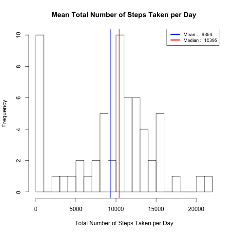
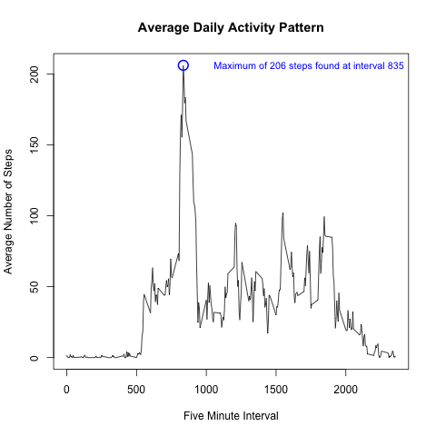
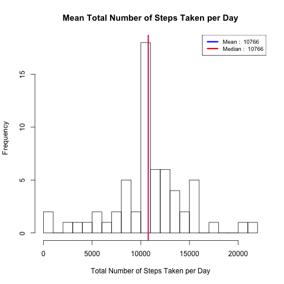
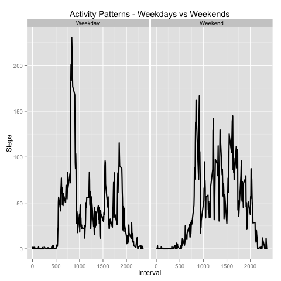

## Loading and preprocessing the data
```r
## Load the data (i.e. read.csv())
activity <- read.csv("activity.csv")

## Process/transform the data (if necessary) into a format suitable for your analysis

# Converts a provided vector into a numeric one
as_numbers <- function(v) {
  v <- as.numeric(v)
  
  # Flag all non-missing non-numeric values as missing
  v[is.nan(v)] <- NA  
}

# Treat steps as numeric values
as_numbers(activity$steps)

# Treat intervals as numeric values
as_numbers(activity$interval)

# Convert cells of the 'date' column into date values in YYYY-MM-DD format
activity$date <- as.Date(activity$date, "%Y-%m-%d")
```


## What is mean total number of steps taken per day?
```r
# Summarize daily total steps, skip missing values
total_steps <- aggregate(list(steps = activity$steps), list(date = activity$date), sum, na.rm = TRUE)

# Render a histogram of daily total steps
png("plot1.png")
hist(total_steps$steps, 
     breaks = 20, 
     main = "Mean Total Number of Steps Taken per Day",
     xlab = "Total Number of Steps Taken per Day")

# Additional aggregations along with visualization info
activity_stats <- data.frame(
  val = c(
    round(mean(total_steps$steps)), 
    round(median(total_steps$steps))),
  col = c("blue", "red"),
  lbl = c("Mean", "Median"))

# Plot each of the aggregations
apply(activity_stats, 1, function(x) {
  abline(v=x["val"], lwd = 2, col = x["col"])
})

# Add a legend
legend('topright', lty = 1, lwd = 3, col = as.character(activity_stats$col),
       cex = .8,
       legend = apply(activity_stats, 1, function(x) {
         paste(x["lbl"], ": ", x["val"])
       }))

# Render the graphics
dev.off()
```



## What is the average daily activity pattern?
```r
# Make a time series plot (i.e. type = "l") of the 5-minute interval (x-axis) and the average number of steps taken, 
# averaged across all days (y-axis)

avg_steps <- aggregate(list(steps = activity$steps), list(interval = activity$interval), mean, na.rm = TRUE)

png("plot2.png")
with(avg_steps, {
  
  # Which 5-minute interval, on average across all the days in the dataset, contains the maximum number of steps?
  max_steps <- avg_steps[which.max(steps), ]
  
  # Time series
  plot(interval, steps, type = "l",
       main = "Average Daily Activity Pattern",
       xlab = "Five Minute Interval",
       ylab = "Average Number of Steps")  
  
  # Plot the found maximum
  max_step_col <- "blue"
  points(max_steps$interval,  max_steps$steps, col = max_step_col, cex = 2, lwd = 2, pch = 1)
  
  # Add a legend
  legend("topright",
         legend = paste("Maximum of", 
                        round(max(max_steps$steps)), 
                        "steps found at interval", 
                        max_steps$interval),
                  text.col = max_step_col, cex = .9, bty = 'n')
})

# Render the graphics
dev.off()
```


## Imputing missing values
```r
## Task 3a: Calculate and report the total number of missing values 
## in the dataset (i.e. the total number of rows with NAs)
missing_steps <- nrow(activity[is.na(activity$steps),])
print(paste("There are", missing_steps, "missing steps in total"))

## Task 3b: Devise a strategy for filling in all of the missing values 
## in the dataset. The strategy does not need to be sophisticated. 
## For example, you could use the mean/median for that day, 
## or the mean for that 5-minute interval, etc.

# Chosen strategy: Missing values will be replaced with mean values
# calculated in the previous step

## Task 3c: Create a new dataset that is equal to the original dataset 
## but with the missing data filled in.
complete_activity <- activity
complete_activity$steps = mapply(function(x, y) {
  if (is.na(x)) { return (y) }
  else return (x)
}, complete_activity$steps, avg_steps$steps)
total_steps_complete <- aggregate(steps ~ date, complete_activity, sum)

## Task 3d: Make a histogram of the total number of steps taken each day 
## and Calculate and report the mean and median total number of steps taken per day. 
## Do these values differ from the estimates from the first part of the assignment? 
## What is the impact of imputing missing data on the estimates of the total daily number of steps?

# A histogram of the total number of steps taken each day
png("plot3.png")
hist(total_steps_complete$steps, 
     breaks = 20, 
     main = "Mean Total Number of Steps Taken per Day",
     xlab = "Total Number of Steps Taken per Day")

# Additional aggregations along with visualization info
activity_stats <- data.frame(
  val = c(
    round(mean(total_steps_complete$steps)), 
    round(median(total_steps_complete$steps))),
  col = c("blue", "red"),
  lbl = c("Mean", "Median"))

# Plot each of the aggregations
apply(activity_stats, 1, function(x) {
  abline(v=x["val"], lwd = 2, col = x["col"])
})

# Add a legend
legend('topright', lty = 1, lwd = 3, col = as.character(activity_stats$col),
       cex = .8,
       legend = apply(activity_stats, 1, function(x) {
         paste(x["lbl"], ": ", x["val"])
       }))

# Render the graphics
dev.off()
```


## Are there differences in activity patterns between weekdays and weekends?
```r
# Add a new column to keep the 'day type' (a weekday or a weekend)
complete_activity$daytype = ifelse(
  weekdays(complete_activity$date) %in% c("Saturday", "Sunday"), "Weekend", "Weekday")

# Group by day type and interval
total_steps_by_daytype <- aggregate(
  list(steps = complete_activity$steps), 
  list(interval = complete_activity$interval, daytype = complete_activity$daytype), 
  mean, na.rm = TRUE)

# Plot it
png("plot4.png")
avg_steps_by_daytype <- ggplot(total_steps_by_daytype, aes(interval, steps)) +
  ggtitle("Activity Patterns - Weekdays vs Weekends") +
  facet_grid(. ~ daytype) +
  geom_line(size = 1) + 
  xlab("Interval") + 
  ylab("Steps")

print(avg_steps_by_daytype)
dev.off()
```

